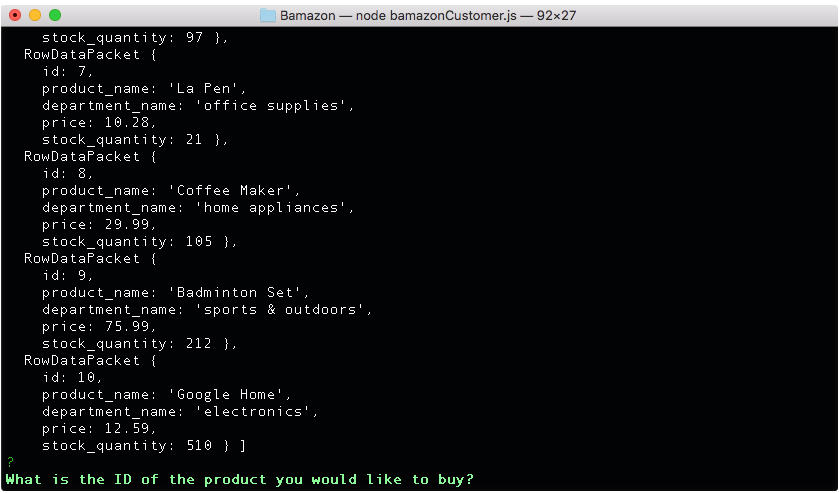
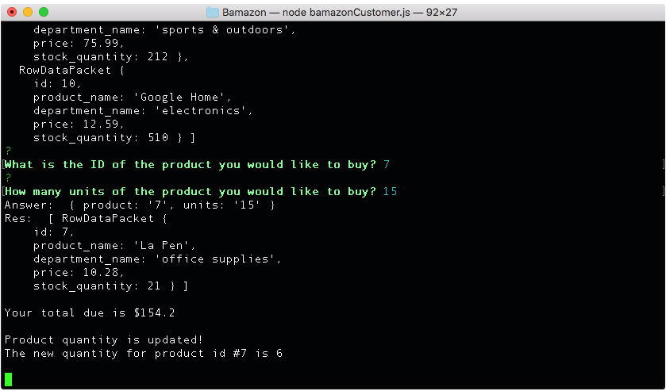
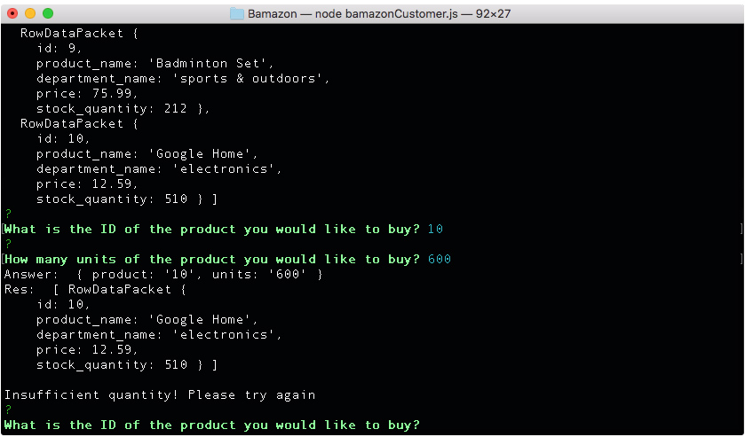

# Bamazon App

This app allows you to take customers orders and update stock quantity after the order has been placed

## Step One

Download Bamazon app. Navigate to it's directory and run this command in your terminal.

```
node bamazonCustomer.js
```
You should now be able to see the inventory and a question asking you for a product ID as seen on the screenshot. 




## Step Two

Enter the product ID of your choice. The number shouldn't exceed "10". Next you'll be prompted to enter the quantity of the product you'd like to purchase. If there's a sufficient product quantity, you'll be given a total dollar amount you owe and the remaining product units amount.





If the product amount is insufficient, and error message will appear and the product ID and units will have to be re-entered.





### Built With 

- nodeJS
- MySQL
- NPM packages (mysql & inquirer)
- much effort, fueled by coffee